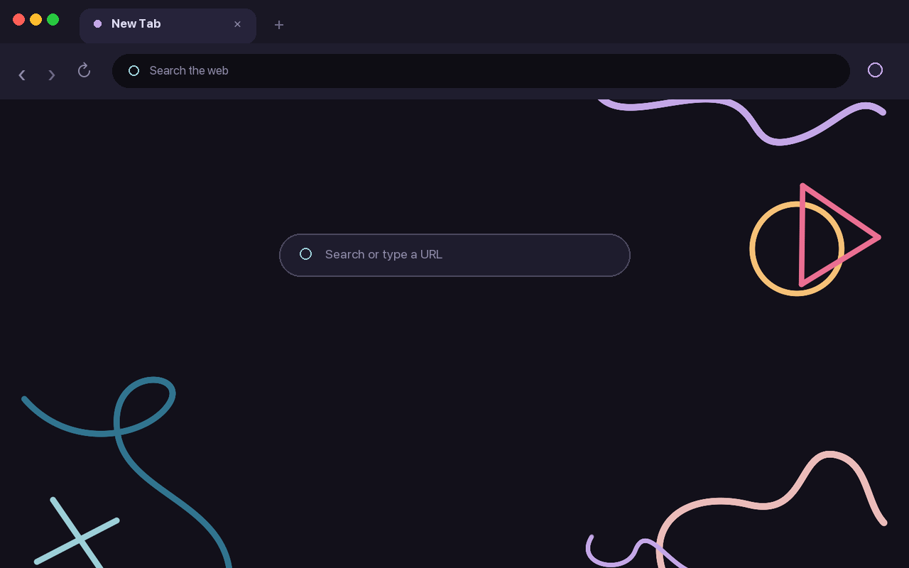

# Rosé Pine — Afterglow

A calm, modern dark theme for Chrome, built with the [Rosé Pine](https://rosepinetheme.com/) palette.

Afterglow is an independent community theme inspired by the Rosé Pine palette. It is not an official Rosé Pine release. Enjoy my take on a favorite palette of mine! :)

## Highlights

- Deep plum browser frame
- Dark toolbar and address bar
- Clear active and inactive tabs
- White bookmark labels
- Minimal illustrated new-tab background
- No scripts, permissions, tracking, or data collection

## Install manually

1. Download and unzip this project.
2. Open `chrome://extensions` in Chrome.
3. Turn on **Developer mode**.
4. Select **Load unpacked** and choose the unzipped project folder.

To remove the theme, open Chrome's appearance settings and select **Reset to default**.

